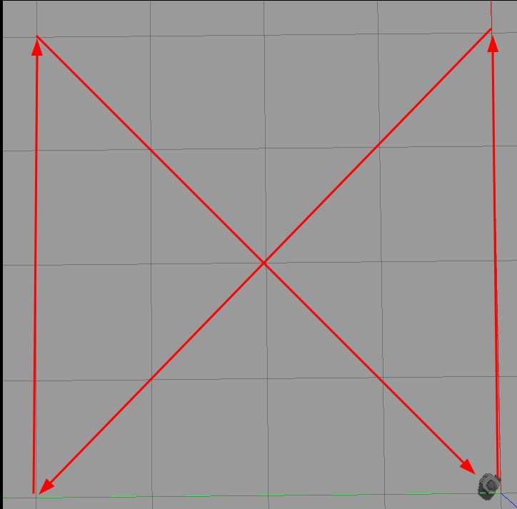

## Description

A example of implementation on [Gazebo simulator](https://gazebosim.org/) in [ROS2](https://index.ros.org/doc/ros2/) using python and rclpy library. The project is mainly oriented by modules, on each module part is a pipeline comunication with turtlesim node. Has a module for each part of the pipeline, like a module for publish the velocity, another for subscribe the position, another for get LIDAR data, etc. The main controller is a module manager, that manage all modules and call the modules functions.

### Modules folders:

-   `clients`: Contains the clients of turtles entitys and simulator services.
-   `parameters`: Contains the parameters setter and getter of gazebo.
-   `publishers`: Contains the publishers of gazebo topics.
-   `subscribers`: Contains the subscribers of gazebo.

The main controller is named `TurtleBotController` and receive a instance of `ModulesManager` for manage all modules, adding and accessing them, with this practice is possible to add new modules without change the main controller, or call a module from another module... A very flexible and scalable architecture!

The main source code can be founded in [ros2_ws/gazeboexample/gazeboexample](./ros2_ws/gazeboexample/gazeboexample) folder. The **init**.py file has the main file entrypoint for the node module.

### How to run:

-   Install ROS2 and Gazebo
-   Clone this repository
-   Run the command `colcon build --packages-select gazeboexample` in the root folder of the `ros2_ws/gazeboexample`
-   Run the command `source install/setup.bash` in the root folder of the `ros2_ws/gazeboexample`
-   Run the command `ros2 launch gazeboexample gazeboexampleendpoint` in the root folder of the `ros2_ws/gazeboexample`

### Positions objetives:

All the positions is mapped in the [path.csv](artifacts/path.csv) file, the positions is in the format: `x,y`. The initial position of the turtlebot is `(0,0)`. Currently the path is:

-   4,0
-   0,4
-   4,4
-   0,0

Following the path, the turtlebot will move like:

### Demo video:

https://github.com/ViniciosLugli/gazebo-ROS-example/assets/40807526/f6ade1a5-95d1-488b-8cd9-b1c8fc59a6f6
